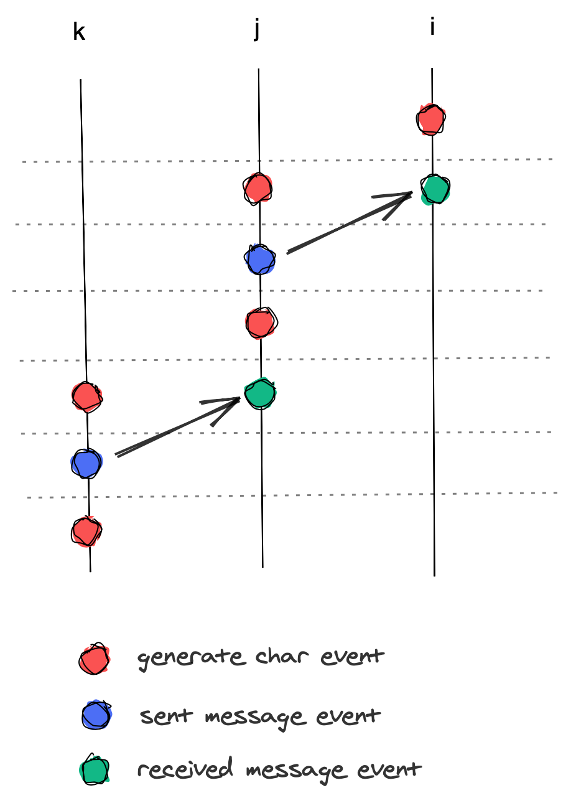

How do you order events that happens between and within distributed processes? Let’s assume that each of the processes keeps a list of:

1. All the events that happened within itself
2. And all events related to sending and receiving messages between processes

To sort the list of events, we would need to determine if a particular event _happens before_ another event. One option would be to tag each event with DateTime of when the event occurred. Alternatively, one could also use Unix Timestamp, instead of DateTime, and avoid all the hassle of timezone and daylight savings time. But, there is no guarantee that time runs the same in all the distributed processes. Time synchronisation with NTP have accuracy level within tens of milliseconds, assuming the network is good and polled within 36 hours [1]. Another risk would be _Leap Second_ and the documented problems arising from it [2]

DateTime and Unix Timestamp are considered as _Physical Clocks_. Alternative to them are _Logical Clock_ and we are going to implement one of such clock called Lamport Timestamp (or Lamport’s Logical Clock). The implementation is heavily inspired by the famous paper by Leslie Lamport, titled “Time, Clocks, and the Ordering of Events in a Distributed System” [3]. Anytime _clock_ is mentioned after this, it will refer to _Logical Clock_.

## Definition (DEF)

1. If `a` and `b` are events in the same process and `a` happens before `b`, then `a -> b` . The `->` means _happens before_.
2. If `a` is the sending of a message by one process and `b` is the receipt of the same message by another process, then `a -> b`.
3. If `a -> b` and `b -> c` then `a -> c`.  This means the ordering of the events are transitive.
4. Two distinct events `a` and `b` are said to be concurrent if  `a -/-> b` and `b -/-> a`. This would happen if `a` and `b` happens in separate processes and there were no messages sent or received among the two processes between event `a` and `b`.

## Distributed events between processes

The logical clock can be implemented simply as a counter. In order to view which clock belongs to which process, we’ll create a `Clock` struct with a `timestamp` field to act as a counter and a `process_name` to identify the process it belongs to. For convenience, the code below also includes two functions for interfacing with the `Clock`:

1. `increment` which returns a new `Clock` with an incremented timestamp
2. `timestamp` to return the timestamp value of a `Clock`

```elixir
defmodule Clock do
  defstruct [:timestamp, :process_name]

  def increment(clock = %Clock{timestamp: timestamp}) do
    %Clock{ clock | timestamp: timestamp + 1 }
  end

  def timestamp(clock) do
    Map.get(clock, :timestamp) 
  end
end
```


For each event, we would want to know the name of the event as well as when it happens. So, a clock is needed as well.

```elixir
defmodule Event do
  defstruct [:name, :clock]

  def timestamp(event) do
    Map.get(event, :clock)
    |> Map.get(:timestamp)
  end

  def process_name(event) do
    Map.get(event, :clock)
    |> Map.get(:process_name)
  end
end
```

### Implementation Rules (IR)

The implementation rules for the events and clock are quite straightforward:

1. Each process will have its internal logical clock
2. When an event happens within the process, increment the clock and assign it to the event
3. When a process wants to send a message to another process, it will create  a `Sent` event.
4. When process `a` sends a message to process `b`, the message must contain the `timestamp` from process `a`’s clock.
5. When a process receives a message from another process, it will create a `Received` event

## Events ordering

Let’s build something to demonstrate the clock and ordering of events between distributed processes. We’ll emulate distributed processes using `GenServer` and the application we’ll build is the Worst Random String Generator (WRSG)

We would not focus on actually building the logic for the Generator. The goal would be to demonstrate all the implementation rules above and see if we can actually create events with Lamport’s Timestamp.

We’ll start simple, with intra process events. The WRSG will be generating strings one char at a time. Every time the process receives a command to generate a char, it will create an event and observes the IR1 and IR2 above.

Here is the starting code:

```elixir
require Event
require Clock

defmodule Generator do
  use GenServer

  def generate_char(name) do
    GenServer.cast(name, :generate_char) 
  end

  def get_events(name) do
    GenServer.call name, :events  
  end

  def start_process(name) do
    GenServer.start_link __MODULE__, %{name: name}, name: name 
  end

  ### GENSERVER IMPLEMENTATIONS ###

  @impl true
  def init(%{name: name}) do
    {:ok, %{name: name, events: [], clock: %Clock{process_name: name, timestamp: 0}}} 
  end

  @doc """
  Returns all the events stored in the state
  """
  @impl true
  def handle_call(:events, _from, state = %{ events: events }) do
    {:reply, events, state} 
  end

  @doc """
  Process use this to generate char internally
  """
  @impl true
  def handle_cast(:generate_char, state = %{clock: clock, events: events}) do
    updated_clock = Clock.increment(clock)
    new_event = %Event{name: :generate_char, clock: updated_clock}
    state = %{ state | clock: updated_clock }

    {:noreply, %{state | events: [ new_event | events] } }
  end  
end
```

The code uses the `Clock` and `Event` structs defined earlier. When the process starts, in `init`, you’ll notice that the process initializes a `Clock` and stores it in its state. This will be its internal logical Clock and fulfils IR1.

Next, in `handle_cast(:generate_char, ...)`, the process:

1. Gets its internal clock and increment it
2. Create a new `Event` with the updated clock
3. Updates its internal clock

Let’s try running this in `iex` (it is assumed that `Clock`, `Event` and `Generator` are already compiled)

```elixir
iex> Generator.start_process(:a)
iex> Generator.generate_char(:a)
iex> Generator.generate_char(:a)
iex> Generator.get_events(:a)
[
  %Event{clock: %Clock{process_name: :a, timestamp: 2}, name: :generate_char},
  %Event{clock: %Clock{process_name: :a, timestamp: 1}, name: :generate_char}
]
```

Events within a process is simple enough. We’ll move on to the interesting bit, combining with events between processes. The goal is to have 3 processes, each with its own task to complete and have messages sent from one process to another. Below is a space-time diagram to illustrate what we want to achieve.



Each vertical line is a process, the arrows are messages being sent from one process to another and each dots are events. Here the events are colour coded. The vertical direction also helps to display movement of “time”, bottom to top representing oldest to latest. 

If we would like our processes to behave as in the diagram above, calling `gennerate_char` from `iex` will not be adequate. We’ll need a way to inform the process of the tasks that it needs to perform. To achieve that, we’ll add a new state to the process, which is a lambda that will contain the necessary steps for the process to execute. Since the tasks for the process are within the lambda, we’ll need a way to kick off the process, let’s create a new function for that as well. Here are the changes and new methods.

```elixir
defmodule Generator do
  # Only showing the changes from the previous Generator code

  # func will be function that contains the tasks to be executed
  # by the process when run() is called
  def start_process(name, func) do
    GenServer.start_link __MODULE__, %{name: name, func: func}, name: name 
  end

  def run(name) do
    GenServer.cast name, :run
  end

  ### GENSERVER IMPLEMENTATIONS ###

  @impl true
  def init(%{name: name, func: func}) do
    {:ok, %{name: name, func: func, events: [], clock: %Clock{process_name: name, timestamp: 0}}} 
  end

  @doc """
  This is for kickstarting the execution
  """
  @impl true
  def handle_cast(:run, state = %{ func: func }) do
    func.()        

    {:noreply, state}
  end
end
```

Fire up the `iex` again and let’s try to generate the same list of events as previous done.

```elixir
iex> fun = fn() ->
   > Generator.generate_char(:a)
   > Generator.generate_char(:a)
   > end
iex> Generator.start_process(:a, fun)
iex> Generator.run(:a)
iex> Generator.get_events(:a)
[
  %Event{clock: %Clock{process_name: :a, timestamp: 2}, name: :generate_char},
  %Event{clock: %Clock{process_name: :a, timestamp: 1}, name: :generate_char}
]
```

Great! Now we could start different `Generator` processes that will run different steps if needed. Next, we need a few functions to `send` and `receive` messages between processes. A process will use these functions to ask other process to do work. For convenience, a few functions also being added to start off the 3 difference processes including the tasks that each process should be executing. As well as a function to gather all the events from all the processes.

```elixir
defmodule Generator do
  # Only showing the changes from the previous Generator code
 def start_process_a do
    fun = fn() ->
      Generator.generate_char(:a)  
      Generator.send_generate_message(:a, :b)
      Generator.generate_char(:a)  
    end

    Generator.start_process(:a, fun)
  end

  def start_process_b do
    fun = fn() ->
      Generator.generate_char(:b)  
      Generator.send_generate_message(:b, :c)
      Generator.generate_char(:b)  
    end

    Generator.start_process(:b, fun)
  end

  def start_process_c do
    fun = fn() ->
      Generator.generate_char(:c)  
    end

    Generator.start_process(:c, fun)
  end

  def get_all_events do
    get_events(:a)
    |> Enum.concat(get_events(:b))
    |> Enum.concat(get_events(:c))
  end

  def send_generate_message(from, to) do
    GenServer.cast from, {:send_generate_message, to}  
  end

  ### GENSERVER IMPLEMENTATIONS ###

  @doc """
  This is to simulate an API for a process to receive message from other processes to generate chars
  """
  @impl true
  def handle_cast({ :generate, from }, state = %{ name: name }) do
    GenServer.cast name, {:received, from}
    run(name)

    {:noreply, state}
  end

  @impl true
  def handle_cast({ :send_generate_message, to}, state = %{ name: name, events: events, clock: clock }) do
    updated_clock = Clock.increment(clock)
    new_event = %Event{name: :sent_message, clock: updated_clock }
    state = %{ state | events: [ new_event | events ] }

    GenServer.cast to, { :generate, name }

    {:noreply, %{ state | clock: updated_clock }}
  end

  @impl true
  def handle_cast({ :received, from }, state = %{ events: events, clock: clock }) do
    updated_clock = Clock.increment(clock)
    new_event = %Event{name: "received from #{from}", clock: updated_clock}
    state = %{ state | events: [ new_event | events] }

    {:noreply, %{ state | clock: updated_clock }}
  end
end
```

The main changes surrounds the three new `handle_cast` functions. First is `handle_cast({ :generate, ...`, this is how the processes can receive message from another process in order to begin executing its tasks. Before it calls `run` notice that, the first thing a process does when it gets a `:generate` message is to invoke `handle_cast({ :received, ...`. This function’s main goal is to create a new event to mark that it has received a message.  The last function is `handle_cast({ :send_generate_message, ...`, this function is to emulate a process ability to send messages to another process. Its main purpose is to create a new event before actually sending the message.

Let’s give it a run in `iex`

```elixir
iex> Generator.start_process_a
iex> Generator.start_process_b
iex> Generator.start_process_c
iex> Generator.run :a
```


Now that we’ve ran all the processes, if we call `Generator.get_all_events()`  and try to sort the resulting list of events, we should get something like below:

```elixir
iex> events = Generator.get_all_events()
iex> Enum.sort(events, &(Event.timestamp(&1) > Event.timestamp(&2)))
[
  %Event{clock: %Clock{process_name: :b, timestamp: 4}, name: :generate_char},
  %Event{clock: %Clock{process_name: :b, timestamp: 3}, name: "sent to c"},
  %Event{clock: %Clock{process_name: :a, timestamp: 3}, name: :generate_char},
  %Event{clock: %Clock{process_name: :c, timestamp: 2}, name: :generate_char},
  %Event{clock: %Clock{process_name: :b, timestamp: 2}, name: :generate_char},
  %Event{clock: %Clock{process_name: :a, timestamp: 2}, name: "sent to b"},
  %Event{clock: %Clock{process_name: :c, timestamp: 1}, name: "received from b"},
  %Event{clock: %Clock{process_name: :b, timestamp: 1}, name: "received from a"},
  %Event{clock: %Clock{process_name: :a, timestamp: 1}, name: :generate_char}
]
```

The events are not sorted properly. There are a couple of reasons for this, but one of them is because our code violated the DEF 2. To fix that, we have to alter our implementation rules a bit. Changes are in bold:

## Updated Implementation Rules (UIR)
1. Each process will have its internal logical clock
2. When an event happens within the process, increment the clock and assign it to the event
3. When a process wants to send a message to another process, it will create  a `Sent` event
4. When a process receives a message from another process, it will:
	1. **Updates its internal logical clock to `max(message_timestamp, process_timestamp)`**
	2. **Create a `received` event**

Let’s update a few functions.

```elixir
defmodule Generator do

 ### GENSERVER IMPLEMENTATIONS ###

  @doc """
  This is to simulate an API for a process to receive message from other processes to generate chars
  """
  @impl true
  def handle_cast({ :generate, message_timestamp, from }, state = %{ name: name }) do
    # start change
    GenServer.cast name, {:received, message_timestamp, from}
    # end change
    run(name)

    {:noreply, state}
  end

  @impl true
  def handle_cast({ :send_generate_message, to}, state = %{ name: name, events: events, clock: clock }) do
    updated_clock = Clock.increment(clock)
    new_event = %Event{name: "sent to #{to}", clock: updated_clock }
    state = %{ state | events: [ new_event | events ] }

    # start change
    GenServer.cast to, { :generate, %Clock.timestamp(updated_clock), name }
    # end change

    {:noreply, %{ state | clock: updated_clock }}
  end

  @impl true
  def handle_cast({ :received, message_timestamp, from }, state = %{ events: events, clock: clock }) do
    # start change
    latest_timestamp = max(Clock.timestamp(clock), message_timestamp)
    updated_clock = %Clock{ clock | timestamp: latest_timestamp + 1 }
    # end change
    new_event = %Event{name: "received from #{from}", clock: updated_clock}
    state = %{ state | events: [ new_event | events] }

    {:noreply, %{ state | clock: updated_clock }}
  end
end
```

If we ran the processes, get all the events and sort them, the list should look something like below:

```elixir
[
  %Event{clock: %Clock{process_name: :c, timestamp: 7}, name: :generate_char},
  %Event{clock: %Clock{process_name: :c, timestamp: 6}, name: "received from b"},
  %Event{clock: %Clock{process_name: :b, timestamp: 6}, name: :generate_char},
  %Event{clock: %Clock{process_name: :b, timestamp: 5}, name: "sent to c"},
  %Event{clock: %Clock{process_name: :b, timestamp: 4}, name: :generate_char},
  %Event{clock: %Clock{process_name: :b, timestamp: 3}, name: "received from a"},
  %Event{clock: %Clock{process_name: :a, timestamp: 3}, name: :generate_char},
  %Event{clock: %Clock{process_name: :a, timestamp: 2}, name: "sent to b"},
  %Event{clock: %Clock{process_name: :a, timestamp: 1}, name: :generate_char}
]
```

Now it looks better. But, there are a couple of events that still have the same timestamp and they can swap places on each ordering because their value are the same. These events are an example of `concurrent` events, as mentioned in DEF 4. And this particular kind of ordering is called `partial ordering`.

The paper suggest that we could achieve `total ordering`, where there are no ambiguity or events swapping places on each order if we can find a way to break the tie. One way to achieve that is to give each process a weight and use the weight as a tiebreaker. For example, we could determine that `a > b > c` and if there are any events that share the same `timestamp`, we could fall back to the process hierarchy to determine which event sits higher in the ordering.

So far we have learned about how to use Logical Clocks instead of Physical Clocks for generating and ordering events in a distributed process. In part 2, we’ll explore how to use `Lamport's Timestamp` for making decision within a distributed system and how to handle out of order events.

#### References:

1. [https://tools.ietf.org/html/rfc5905](https://tools.ietf.org/html/rfc5905)
2. [https://en.wikipedia.org/wiki/Leap\_second#Issues\_created\_by\_insertion\_(or\_removal)\_of\_leap\_seconds](https://en.wikipedia.org/wiki/Leap_second#Issues_created_by_insertion_(or_removal)_of_leap_seconds)
3. [Time, Clocks and the Ordering of Events in Distributed System [PDF]](https://lamport.azurewebsites.net/pubs/time-clocks.pdf)